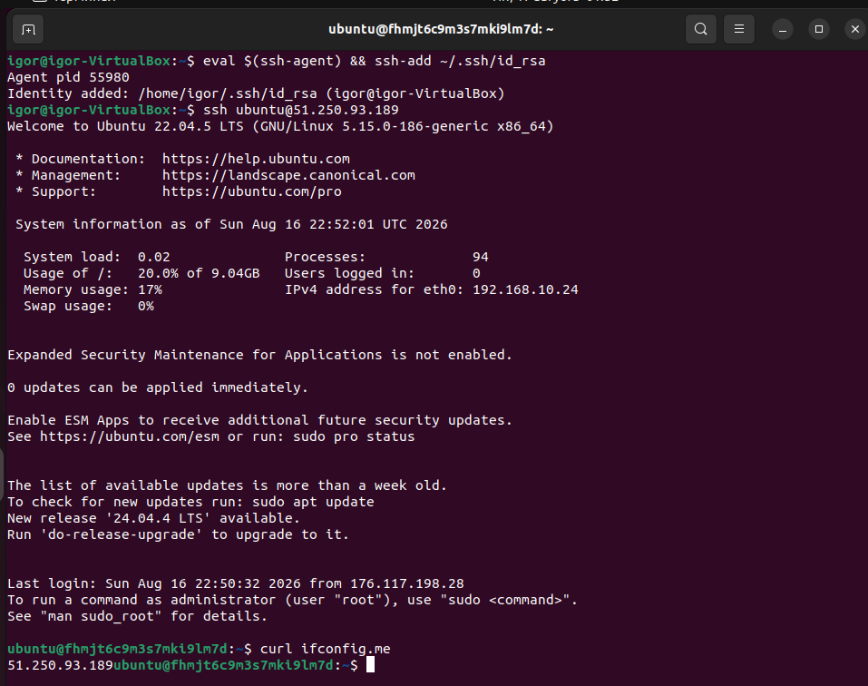
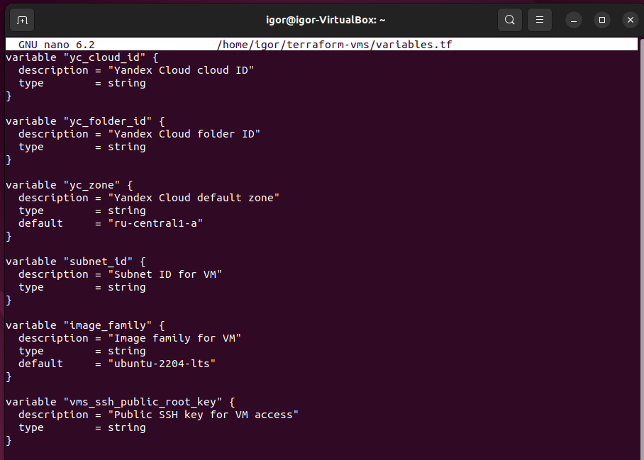
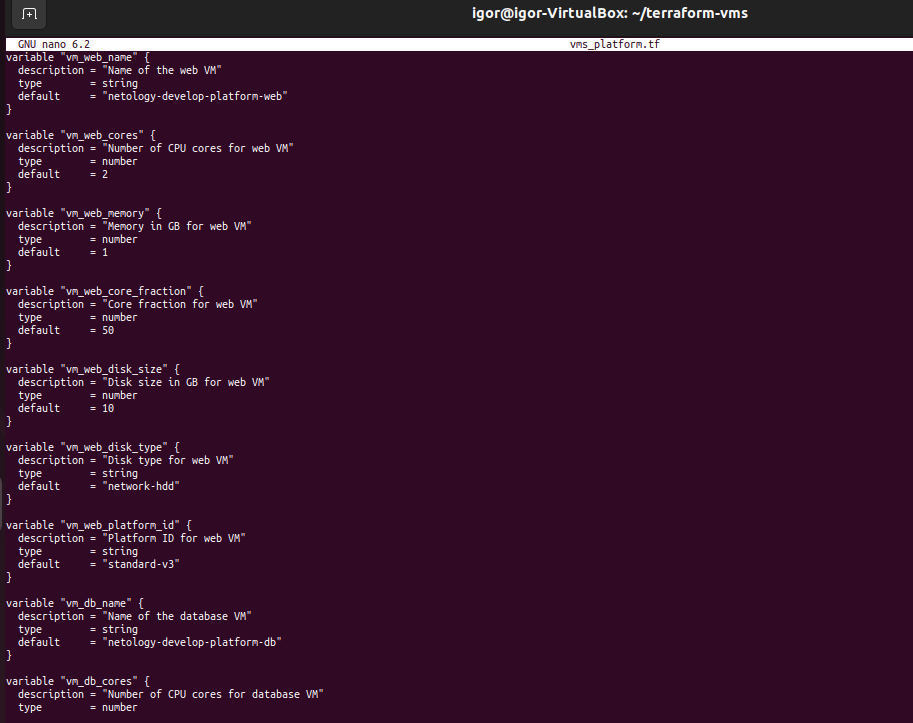
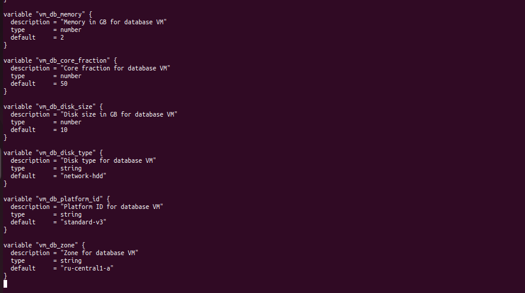
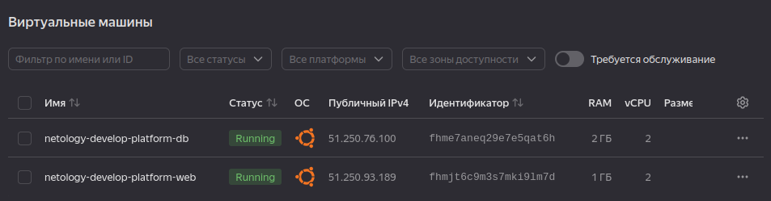
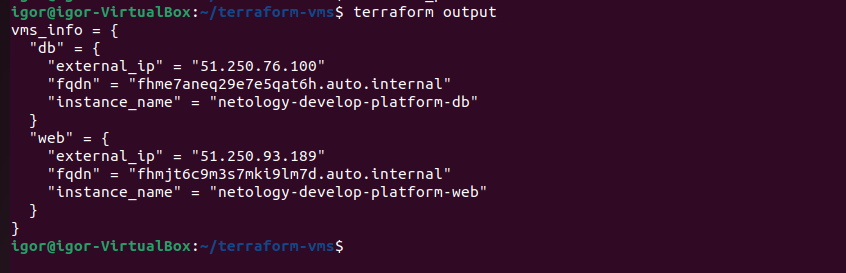
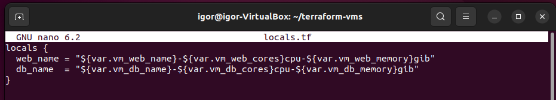
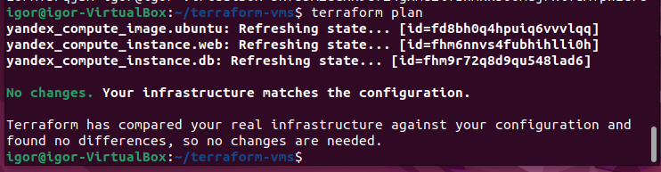

# # Домашнее задание к занятию «Основы Terraform. Yandex Cloud»
Выполнил: Береснев Игорь Андреевич

---

Задание 1

В качестве ответа всегда полностью прикладывайте ваш terraform-код в git. Убедитесь что ваша версия Terraform ~>1.12.0

Изучите проект. В файле variables.tf объявлены переменные для Yandex provider.
Создайте сервисный аккаунт и ключ. service_account_key_file.
Сгенерируйте новый или используйте свой текущий ssh-ключ. Запишите его открытую(public) часть в переменную vms_ssh_public_root_key.
Инициализируйте проект, выполните код. Исправьте намеренно допущенные синтаксические ошибки. Ищите внимательно, посимвольно. Ответьте, в чём заключается их суть.
Подключитесь к консоли ВМ через ssh и выполните команду  curl ifconfig.me. Примечание: К OS ubuntu "out of a box, те из коробки" необходимо подключаться под пользователем ubuntu: "ssh ubuntu@vm_ip_address". Предварительно убедитесь, что ваш ключ добавлен в ssh-агент: eval $(ssh-agent) && ssh-add Вы познакомитесь с тем как при создании ВМ создать своего пользователя в блоке metadata в следующей лекции.;
Ответьте, как в процессе обучения могут пригодиться параметры preemptible = true и core_fraction=5 в параметрах ВМ.

В качестве решения приложите:

скриншот ЛК Yandex Cloud с созданной ВМ, где видно внешний ip-адрес;
скриншот консоли, curl должен отобразить тот же внешний ip-адрес;
ответы на вопросы.

Параметры preemptible = true и core_fraction = 5 в обучении позволяют значительно экономить бюджет, так как первый даёт скидку до 70% за счёт возможности остановки ВМ провайдером в любой момент, а второй снижает стоимость за счёт использования всего 5% мощности ядра, что вполне достаточно для учебных задач вроде тестового веб-сервера или API. Благодаря этому студенты могут многократно создавать и удалять ВМ, экспериментировать с настройками и изучать облачные технологии без риска больших финансовых затрат. На практике для платформы standard-v3 минимальный core_fraction равен 20, поэтому при выполнении задания использовали значение 50.

### Скриншот ЛК Yandex Cloud с созданной ВМ

### Скриншот подключение по SSH и проверка внешнего IP

Задание 2,6

Замените все хардкод-значения для ресурсов yandex_compute_image и yandex_compute_instance на отдельные переменные. К названиям переменных ВМ добавьте в начало префикс vm_web_ . Пример: vm_web_name.
Объявите нужные переменные в файле variables.tf, обязательно указывайте тип переменной. Заполните их default прежними значениями из main.tf.
Проверьте terraform plan. Изменений быть не должно.

Вместо использования трёх переменных ".._cores",".._memory",".._core_fraction" в блоке resources {...}, объедините их в единую map-переменную vms_resources и внутри неё конфиги обеих ВМ в виде вложенного map(object).

Создайте и используйте отдельную map(object) переменную для блока metadata, она должна быть общая для всех ваших ВМ.

Найдите и закоментируйте все, более не используемые переменные проекта.

Проверьте terraform plan. Изменений быть не должно.

### Скриншот файла variables.tf с объявленными переменными

Задание 3

Создайте в корне проекта файл 'vms_platform.tf' . Перенесите в него все переменные первой ВМ.
Скопируйте блок ресурса и создайте с его помощью вторую ВМ в файле main.tf: "netology-develop-platform-db" , cores  = 2, memory = 2, core_fraction = 20. Объявите её переменные с префиксом vm_db_ в том же файле ('vms_platform.tf'). ВМ должна работать в зоне "ru-central1-b"
Примените изменения.

### Скриншот файла vms_platform 

### Скриншот ЛК Yandex Cloud с двумя ВМ

Задание 4

Объявите в файле outputs.tf один output , содержащий: instance_name, external_ip, fqdn для каждой из ВМ в удобном лично для вас формате.(без хардкода!!!)
Примените изменения.

В качестве решения приложите вывод значений ip-адресов команды terraform output

### Скриншот результат terraform output

Задание 5

В файле locals.tf опишите в одном local-блоке имя каждой ВМ, используйте интерполяцию ${..} с НЕСКОЛЬКИМИ переменными по примеру из лекции.
Замените переменные внутри ресурса ВМ на созданные вами local-переменные.
Примените изменения.

### Скриншот locals.tf

Задание 6

Вместо использования трёх переменных ".._cores",".._memory",".._core_fraction" в блоке resources {...}, объедините их в единую map-переменную vms_resources и внутри неё конфиги обеих ВМ в виде вложенного map(object).

Создайте и используйте отдельную map(object) переменную для блока metadata, она должна быть общая для всех ваших ВМ.

Найдите и закоментируйте все, более не используемые переменные проекта.

Проверьте terraform plan. Изменений быть не должно.

### Скриншот terraform plan без изменений

